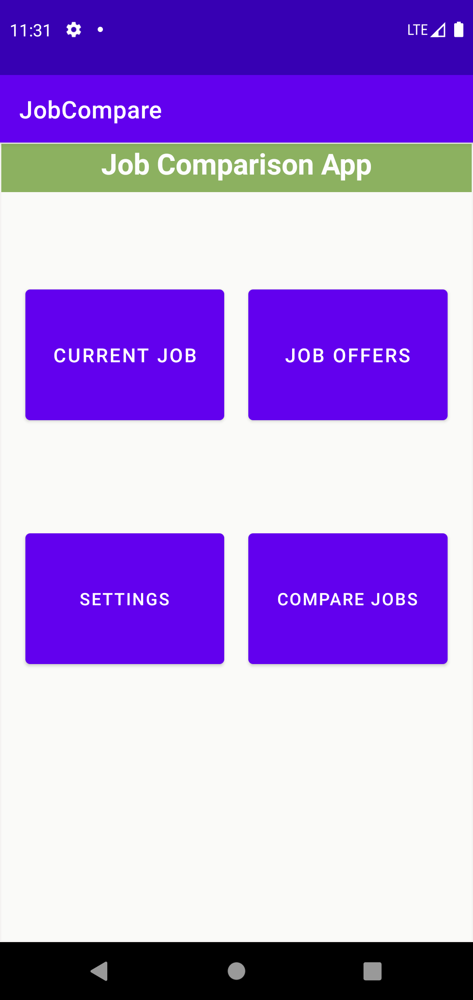
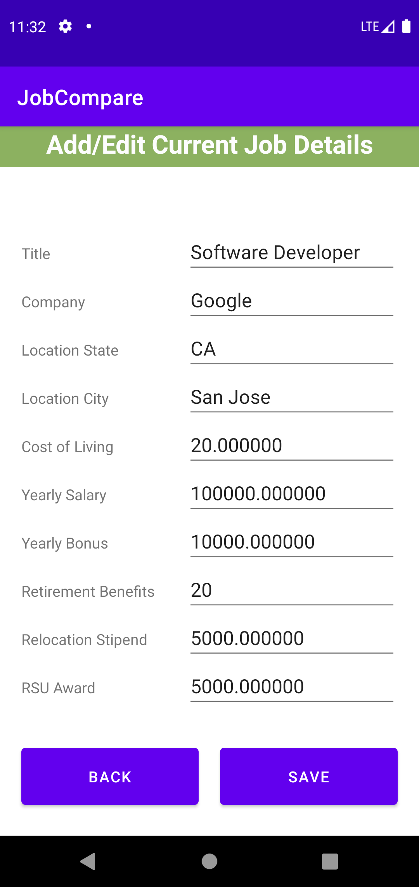
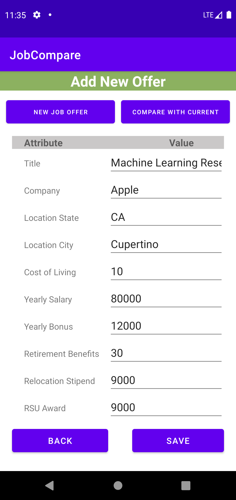
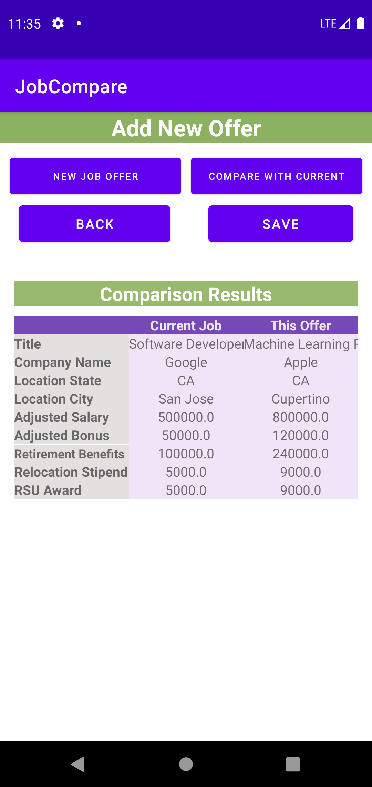
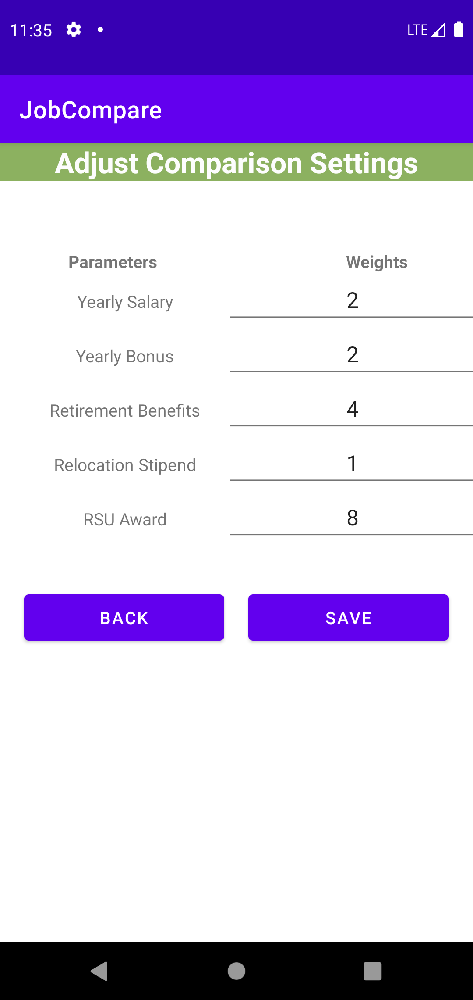
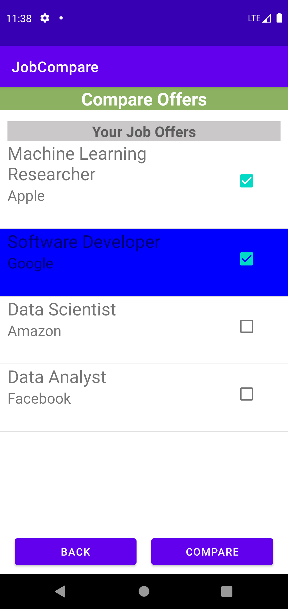
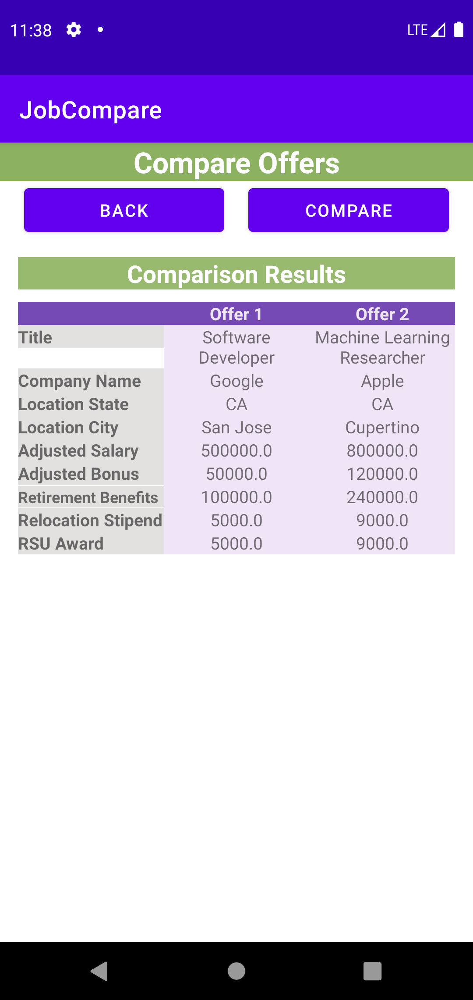

## User Manual 
## JobCompare: Job Offer Comparison App
  

## Index:
1. System Overview
2. Installation
3. Using the Application
    - 3.1 Enter the Application
    - 3.2 Add/Edit current job information
    - 3.3 Enter a new offer 
    - 3.4 Adjust Settings
    - 3.5 Compare Offers

## 1. System Overview
This application, JobCompare, aims to assist you in comparing different offers, and help you make the best decision! In this app, by simply entering your current job information and the offers you get, we can rank all the jobs/offers using the scores calculated by this app. You can also select two jobs/offers to compare them and show the details. The comparison setting can also be adjusted according to your requirement. 

## 2. Installation
This application can be installed on an android device with a minimum screen size of 147.1 mm x 68.8 mm and minimum SDK: API 29: Android 10.0 (Q). SQLite is also required on Android devices.

To install this application, you can download the apk from here: [APK](https://github.com/golden-ice/JopCompare_android). After the download is finished, install the application using your android device, give corresponding authorization for this App, and you are ready to use it!

## 3. Using the Application
### 3.1 Main menu
By double-clicking this app on your android device, you will be led to this view:

These four buttons will lead you to different views. The "ADD CURRENT JOB" button will lead you to the view of entering information about your current job. The "ADD JOB OFFER" button will redirect to the page of adding the offer information you receive. The "ADJUST SETTING" button will allow you to adjust various settings of comparison. To see the ranked jobs/offers, you can click on the "COMPARE OFFERS" button to compare different offers.

If you are first to our app, we recommend you to first add your current job information and add some offers you get for comparison.

### 3.2 Add/Edit current job information
You will be redirected to this page to add or edit the information about your current job. 

To enter job details, just fill in the table with the correct information. After you have filled in all the required info, if you wish to save the information, just click the Save button, and your info will be saved. If you wish to leave without saving, just click the Exit button, and you will be redirected to the main menu.

### 3.3 Enter a new offer 
You will be redirected to this page to add a new offer. 

To add a new offer, just fill in the table with the correct information. Once done with the info filling, you can click the Save button to save the offer you enter, or click Back to return to the main menu. If you want to compare the recently entered offer with the current job, you can first click on Save, then click Compare with Current button, and the detailed comparison will be displayed in the table below.

To enter a new offer, you can click on Enter New Offer, and all info will be cleared and you are free to enter a new offer.

### 3.4 Adjust Settings
You will be redirected to this page to adjust the settings for the comparison.

 

You can enter integer weights for each variable. For bigger weights you assign to a variable, it means it is more important in your comparison. We will use the setting to calculate a score for each job/offer. The formula is：
$AYS + AYB + RS + (RPB * AYS / 100) + (RSUA / 4)$
where:
AYS = yearly salary adjusted for cost of living
AYB = yearly bonus adjusted for cost of living
RBP = retirement benefits percentage
RS = relocation stipend
RSUA = restricted stock unit award

Once you are done with entering the settings, click Save to apply the settings, or click Exit to return to the main menu without saving.

### 3.5 Compare Offers
You will be redirected to this page to see the ranked jobs/offers and do the comparison with any two offers. 

 

All offers including the current job will be displayed in descending order of the calculated score. You can click on two jobs to trigger the comparison, and detailed comparison results will be displayed in the table below.

 
If you wish to start another comparison, click on the new comparison, and the view will be refreshed and you can click on new offers to trigger the comparison. To leave this page, click on Exit, and you will be back to the main menu.
